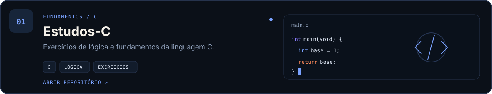
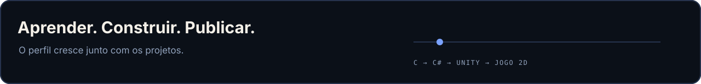
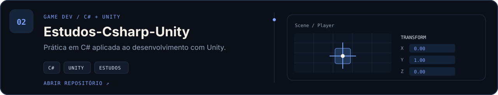
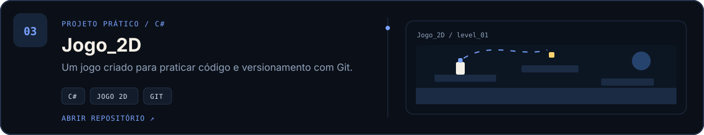

  <a href="https://github.com/salusromelo-prog?tab=repositories">
    <b>EXPLORAR REPOSITÓRIOS ↗</b>
  </a>
  &nbsp;&nbsp;·&nbsp;&nbsp;
  <a href="mailto:salusromelo@gmail.com">
    <b>ENTRAR EM CONTATO ↗</b>
  </a>

 

### Sobre

Sou o Samuel, estudante de **Jogos Digitais em Goiânia**.

Meu interesse por programação começou nos videogames. Hoje,
estou aprofundando minha base em **C#** e usando **Unity** nas
atividades do curso. Quero seguir no desenvolvimento de software,
com autonomia para construir e entender meus próprios projetos.

 

<table>
  <tr>
    <td width="50%" valign="top">
      <h3>C# · Fundamentos</h3>
      

        Meu foco principal de estudo: lógica,
        resolução de problemas e prática com código.
      

      

        LINGUAGEM · RACIOCÍNIO · EXERCÍCIOS
      

    </td>
    <td width="50%" valign="top">
      <h3>Unity · Jogos Digitais</h3>
      

        Onde aplico o que aprendo em scripts,
        mecânicas de jogo e projetos do curso técnico.
      

      

        SCRIPTS · GAMEPLAY · PROJETOS
      

    </td>
  </tr>
</table>

 

### Ferramentas

  

 

Projetos
Do fundamento ao primeiro jogo — uma trilha real do que estou aprendendo.
<a href="https://github.com/salusromelo-prog/Estudos-C">
  <picture>
    <source media="(max-width: 600px)" srcset="./assets/project-c-mobile.svg">
    
  </picture>
</a>
 
Em construção
<table>
  <tr>
    <td width="50%" valign="top">
      <h3>Agora</h3>
      

        Fortalecendo minha base em <b>C e C#</b> e aplicando
        o que aprendo em exercícios e projetos com Unity.
      

      
BASE · PRÁTICA · CONSISTÊNCIA

    </td>
    <td width="50%" valign="top">
      <h3>Próximo marco</h3>
      

        Evoluir o <b>Jogo_2D</b>, organizar melhor os repositórios
        e transformar os estudos em projetos concluídos.
      

      
PROJETOS · GIT · EVOLUÇÃO

    </td>
  </tr>
</table>
 

  
<b>Fora do código</b>

   
  

    Também sou atleta de tênis de mesa. Levo para a programação a mesma ideia
    do treino: praticar, identificar o que precisa melhorar e tentar novamente
    com mais precisão.
  

 
<picture>
  <source media="(max-width: 600px)" srcset="./assets/footer-mobile.svg">
  
</picture>

  <b>Quer trocar uma ideia sobre programação ou jogos?</b>
    
  <a href="mailto:salusromelo@gmail.com">salusromelo@gmail.com ↗</a>

<a href="https://github.com/salusromelo-prog/Estudos-Csharp-Unity">
  <picture>
    <source media="(max-width: 600px)" srcset="./assets/project-csharp-unity-mobile.svg">
    
  </picture>
</a>
 
<a href="https://github.com/salusromelo-prog/Jogo_2D">
  <picture>
    <source media="(max-width: 600px)" srcset="./assets/project-jogo2d-mobile.svg">
    
  </picture>
</a>
 
