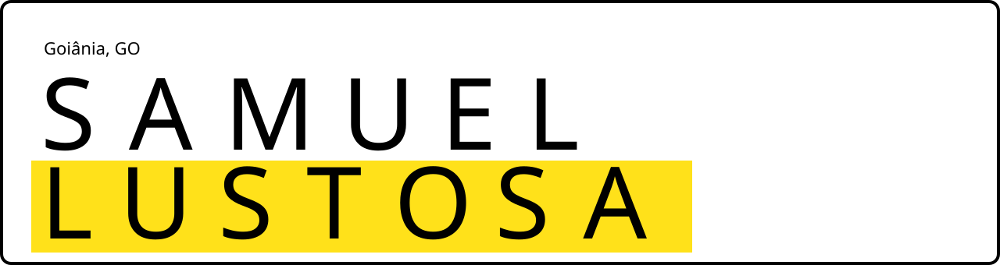
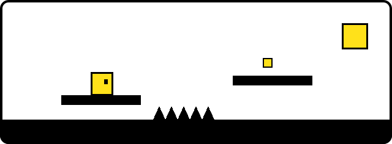
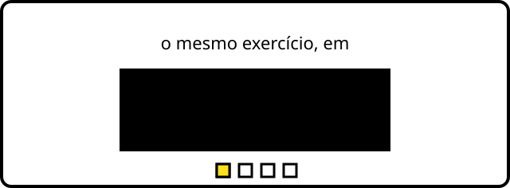
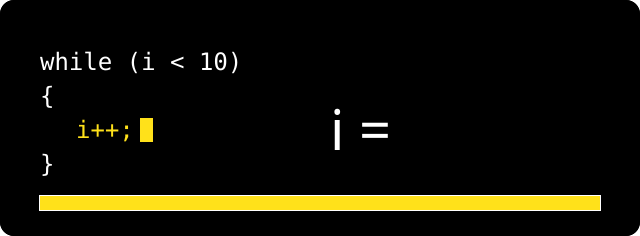

 

Sou o Samuel, estudante de programação em Goiânia.
Faço o curso técnico de Jogos Digitais, onde uso C# e Unity nas aulas. Meu objetivo é seguir no desenvolvimento de software, com autonomia para construir e entender meus próprios projetos.
 

Meu interesse por programação começou nos videogames.
Aprendi lógica primeiro em Portugol, no VisualG. Depois resolvi os mesmos exercícios em C, C++ e Java, para comparar como cada linguagem resolve o mesmo problema.
No curso técnico conheci o C# e o Unity, e foi onde fiz meu primeiro jogo. Agora o próximo passo é sair dos exercícios e construir projetos completos.
 

 

<table>
  <tr>
    <td width="260"></td>
    <td><a href="https://github.com/salusromelo-prog/Jogo_2D"><b>Jogo_2D</b></a> Jogo de plataforma 2D em Unity, com pulo, espinhos, dano e animação. Meu primeiro jogo. C# · Unity 6 · Git</td>
  </tr>
  <tr>
    <td width="260"></td>
    <td><a href="https://github.com/salusromelo-prog/Estudos-Programacao"><b>Estudos-Programacao</b></a> Os mesmos exercícios de lógica resolvidos em VisualG, C, C++ e Java. VisualG · C · C++ · Java</td>
  </tr>
  <tr>
    <td width="260"></td>
    <td><a href="https://github.com/salusromelo-prog/Estudos-Csharp-Unity"><b>Estudos-Csharp-Unity</b></a> Listas de exercícios de <code>while</code> e <code>do while</code> em C#, feitas dentro do Unity. C# · Unity</td>
  </tr>
</table>
 

Sou atleta de tênis de mesa. Levo para a programação a mesma ideia do treino: praticar, identificar o que precisa melhorar e tentar de novo com mais precisão.
 

Quer trocar uma ideia sobre programação ou jogos? Me chama em salusromelo@gmail.com.
