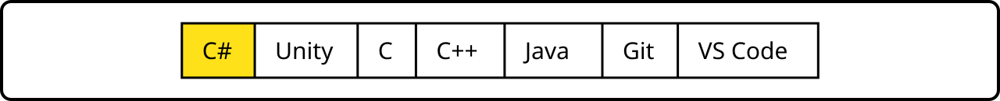
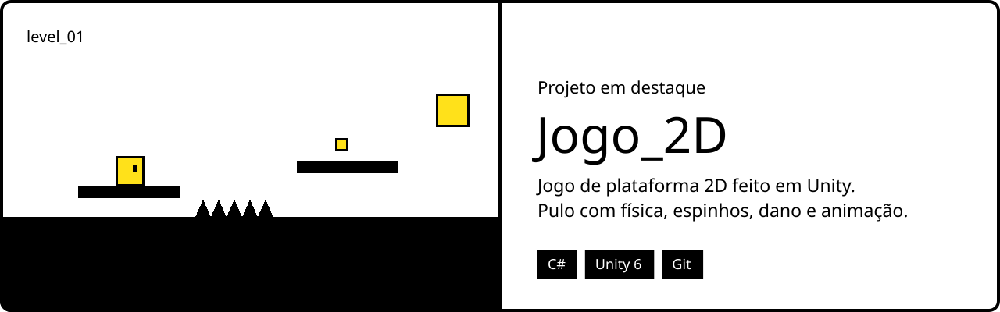
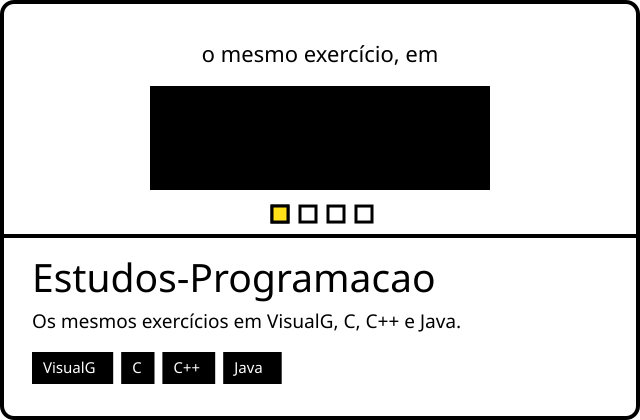
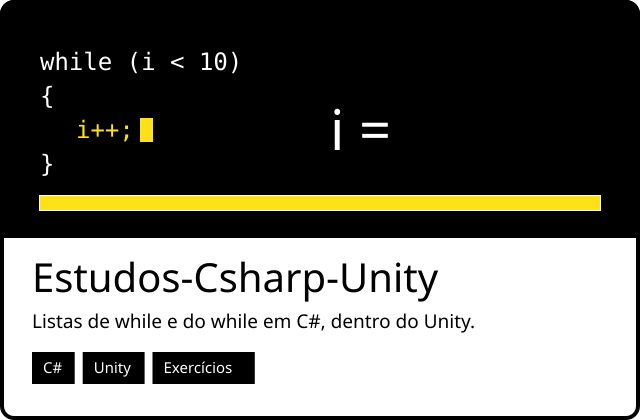
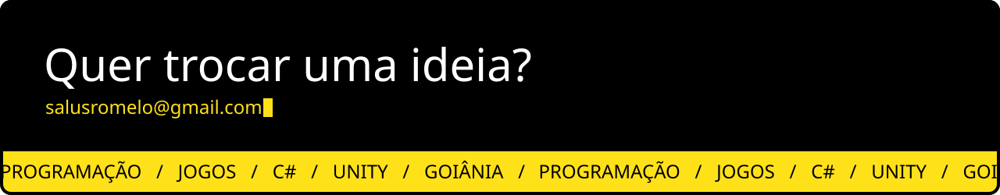

  <a href="https://github.com/salusromelo-prog?tab=repositories"><b>Repositórios</b></a>
  &nbsp;&nbsp;&nbsp;
  <a href="mailto:salusromelo@gmail.com"><b>E-mail</b></a>

Sobre
Sou o Samuel, estudante de Jogos Digitais em Goiânia.
Meu interesse por programação começou nos videogames. Hoje estou aprofundando minha base em C# e usando Unity nas atividades do curso. Quero seguir no desenvolvimento de software, com autonomia para construir e entender meus próprios projetos.

Projetos

  
  

Agora
Fortalecendo a base em C#, evoluindo o Jogo_2D e transformando os estudos em projetos concluídos.
<picture>
  <source media="(prefers-color-scheme: dark)" srcset="./assets/contributions.svg">
  <source media="(prefers-color-scheme: light)" srcset="./assets/contributions-light.svg">
  
</picture>

  
<b>Fora do código</b>

   
  Também sou atleta de tênis de mesa. Levo para a programação a mesma ideia do treino: praticar, identificar o que precisa melhorar e tentar de novo com mais precisão.

 

